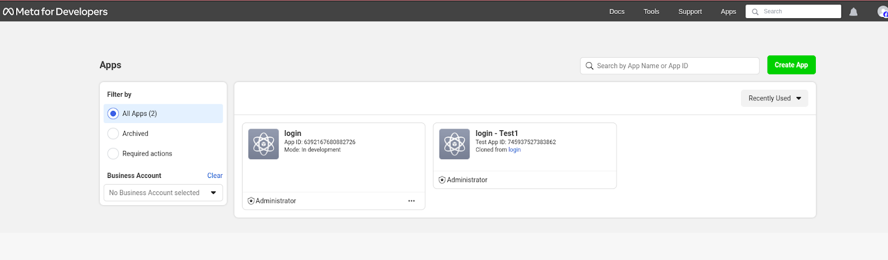

# Google, Facebook, Github Authentication in NEXT JS


<!--  -->


- NextAuth.js, a dynamic open-source authentication library, is your go-to tool for seamlessly integrating authentication and authorization features into your Next.js applications. Tailored for customization, it supports a range of functionalities from email and passwordless authentication to diverse authentication providers like Google and GitHub.

- Think of NextAuth as your authentication ally, functioning as a middleware to simplify the authentication dance between your application and the chosen provider. Picture this: a user initiates a login attempt, seamlessly guided to the sign-in page of the selected provider, let's say Google. After a successful authentication, the provider sends back a payload brimming with crucial user data name, email, you name it. This treasure trove of data becomes the golden ticket, granting access to your application and its coveted resources.

- But that's not all! NextAuth doesn't stop there. Using the information from the payload, it deftly crafts a session for each authenticated user, securely storing the session token in an HTTP-only cookie. This token becomes the guardian of the user's identity, ensuring their authentication status persists. And fear not, the magic is repeatable with other providers, although with minor variations in the implementation.


# Project Setup

## **Step 1 : Create a New Next.js App.**

- Let's initiate the process by creating a fundamental Next.js application in a directory of your choosing—let's call it "Next-Authentication" for this example. Open your terminal and enter the provided command:


```bash
npx create-next-app@latest Next-Authentication
```

**OR**

## **Step 2 : Clone Next.js Application**

- For those looking to implement authentication with popular providers such as Google, GitHub, and Facebook, we've got a ready-to-use solution for you. Simply clone the [NextAuth repository](https://github.com/akash-1045/NextAuth-Google-Github-Facebook) from GitHub using the following Command

```bash

git clone https://github.com/akash-1045/NextAuth-Google-Github-Facebook.git

```

- This repository contains a comprehensive setup for Next.js authentication with Google, GitHub, and Facebook. Take a closer look at the code, customize it according to your needs, and seamlessly integrate authentication into your Next.js application.

## **Step 3 : Head to the Newly Created Directory.**

- This command utilizes the create-next-app package provided by Next.js to set up a new project named "Next-Authentication" with default configurations. After executing this command, navigate into the "Next-Authentication" directory using the following:

```bash

cd Next-Authentication.

```
## **Step 4 : Peek Inside Your Working Directory**

- This will ensure that you are now inside your newly created Next.js application directory; the contents of the working directory should look like this if everything is done successfully.

<div style="text-align:center">

<!--  -->


</div>


## **Step 5: Ignite Your Development Server with a single command.**

- After the setup is complete, navigate to the newly created project directory and run this command to spin up the development server.

```bash
    npm run dev
```
## **Step 6: Witness Your Creation in Action**

- Open your browser and navigate to [http://localhost:3000](http://localhost:3000/). This should be the expected result.


<!--  -->

## **Step 7: Integrate NextAuth in Our Next.js Application**

- First, install NextAuth's library into your project.

```bash
npm install next-auth
```

- Next, in the **src/app** directory, create a new folder and name it **api**. Change the directory to the **API** folder, and create another folder called **auth**. In the **auth** folder, create another folder called **[...nextauth]** . In the **[...nextauth]** folder, add a new file name it **route.js**, and add the following lines of code.

```jsx
/**  src/app/api/auth/[...nextauth]/route.js  */


 import NextAuth from "next-auth";
 import GoogleProvider from "next-auth/providers/google";
 import FacebookProvider from "next-auth/providers/facebook";
 import GithubProvider from "next-auth/providers/github";


 export const authOptions = {
   providers: [
     GoogleProvider({
       clientId: process.env.GOOGLE_CLIENT_ID,
       clientSecret: process.env.GOOGLE_CLIENT_SECRET,
     }),
     FacebookProvider({
       clientId: process.env.FACEBOOK_CLIENT_ID,
       clientSecret: process.env.FACEBOOK_CLIENT_SECRET,
     }),
     GithubProvider({
       clientId: process.env.GITHUB_CLIENT_ID,
       clientSecret: process.env.GITHUB_CLIENT_SECRET,
     }),
   ]
 };


 const handler = NextAuth(authOptions);


 export { handler as GET, handler as POST };

```
- This code configures Google, Github, Facebook as the authentication provider. The NextAuth function defines the Google, Github, and Facebook provider configuration object that takes in two properties: a Client ID and a Client Secret which initializes the provider.

## **Step 8: Harness the Power of NextAuth's Session on the Client Side**

- When it comes to managing session data and authentication status on the client side in a Next.js application, NextAuth offers a convenient solution – the *useSession hook*. However, before diving into its usage, it's crucial to wrap your components in a SessionProvider. Why? Because under the hood, the *useSession hook* relies on React Context.

- The **SessionProvider** component from NextAuth plays a pivotal role in authentication state management for your Next.js app. It requires a session prop, a bundle of authentication session data fetched from the Provider's API. This data typically includes essential user details such as their ID, email, and access token.

- By enveloping your Next.js App component with the SessionProvider, you unleash the potential of the authentication session object across your application. This strategic move empowers your application to persistently access and utilize user details, ensuring seamless rendering of pages based on their authentication state.

- In essence, the **SessionProvider** becomes the cornerstone/basis of your client-side authentication setup, facilitating a smooth and secure user experience throughout your Next.js application.

```jsx
/**  src/providers/NextAuthProvider.jsx  */


 "use client";
 import { SessionProvider } from "next-auth/react";


 const NextAuthProvider = ({ children, session }) => {
   return <SessionProvider session={session}>
           {children}
         </SessionProvider>;
 };


 export default NextAuthProvider;

```

- Next, open the **src/app/layout.js** file and make the following changes to the code.

```jsx
/** src/app/layout.js  */


 import NextAuthProvider from "@/providers/NextAuthProvider";
 import { getServerSession } from "next-auth";
 import { Inter } from "next/font/google";
 import { authOptions } from "./api/auth/[...nextauth]/route";
 import "./globals.css";


 const inter = Inter({ subsets: ["latin"] });


 export const metadata = {
   title: "Next Auth",
   description: "Next Authentication",
 };


 export default async function RootLayout({ children }) {
  
   const session = await getServerSession(authOptions);


   return (
     <html lang="en">
       <body className={inter.className}>
         <NextAuthProvider session={session}>
             {children}
         </NextAuthProvider>
       </body>
     </html>
   );
 }

```

# **Step 9: Setup Credentials**

## **1.  Enlist Your Next.js App with Google Developer Console and Acquire OAuth Credentials**

---

#### **Step 1: Navigate to the Google Developer Console**

- Open your web browser and go to the [Google Cloud Console](https://console.cloud.google.com/).

#### **Step 2: Create a New Project**

- Click on the project dropdown at the top of the page, and then **click on "New Project."**
- Enter a name for your project (e.g., "My Next.js App") and **click "Create."**

#### **Step 3: Create OAuth Client ID**

- In the left sidebar, click on **"APIs & Services" > "Credentials."**
- **Click on "Create Credentials"** and **select "OAuth client ID."**


<!--  -->

- Choose **"Web application"** as the application type.
- Enter a name for your OAuth client ID.
- Authorized JavaScript origins:  **`http://localhost:3000`**
- Authorized redirect URIs: **`http://localhost:3000/api/auth/callback/google`**
- **Click "Create"** to generate the OAuth client ID.

 
<!--  -->

#### **Step 4: Retrieve OAuth Credentials**

- Once created, you'll see your OAuth client ID and client secret. Make a note of these credentials.


## **2. Configure OAuth Credentials with GitHub for Seamless Integration**

---

- Open your web browser and go to the GitHub [**application page**](https://github.com/settings/applications/new).
- Authorized Homepage URL: **`http://localhost:3000`**
- Authorized callback URI: **`http://localhost:3000/api/auth/callback/github`**
- Enter your information and **click on Register application**.


<!--  -->

- Next, Generate a **new client secret** and save both the client ID and client secret somewhere secure.


## **3. Enroll Your Next.js App on the Facebook Developer Console And Acquire OAuth Credentials**

---

#### **Step 1: Create a Facebook App**

- Go to the [**Facebook Developer**](https://developers.facebook.com/) website.
- **Click on "Log In"** and log in with your Facebook account.

For additional details, see the [**Facebook login use case**](https://developers.facebook.com/docs/development/create-an-app/facebook-login-use-case) documentation.

#### **Step 2: Start the app creation process**

There are a number of ways to create an app.

- If you have just completed the signup process, **click the Create First App button.**
- If you are on the [**App Dashboard**](https://developers.facebook.com/apps/), In the top right corner, **click Create App.**




#### **Step 3. Login Type**

- You will be asked if you are building a game, **select No and click Next.**
- If you are building a game and select Yes you will be taken through the [**Facebook Login for Gaming use case app creation flow**](https://developers.facebook.com/docs/development/create-an-app/facebook-login-for-games-use-case/#step-3)


#### **Step 4. App Details**

In this step you will add:

- A name for your app
- The email address to be used to contact you about this particular app

Optionally, you can link this app to an existing Business Account using the dropdown menu, or you can add this later.

**Click Create App to save your app's details**.


 *We will make the **Test App** after generating the New App since the existing generated app requires business verification and many other things, thus we will create the **Test App** of the presently established app.*

### **Step 5. Generating a Test App of Our Current App**

When it comes to crafting a Test App of our existing application, you have various avenues to explore. Follow the steps below based on your scenario:

- If you're currently on the dashboard of your existing app and wish to **create a test app**, head to the **"Apps" section in the navbar**. Look for the **"Create Test App"** button and give it a **click**.
  - Select your existing app's **3-dot-drop-down** list and **click the Create Test App button.**
- If you are on an existing app's dashboard and wish to **create a test app**, pick the **drop-down menu in the top left and then click the Create Test App option.**

<!-- 
 -->


---


### **Step 6. Acquire Test App Credentials**

Navigate to the **App Settings** on the dashboard and **select "Basic"** under App Settings. Follow these configuration steps:

- Make the following configurations:
  - Add **"App domains"** as: **`http://localhost:3000`**
  - Set **"Privacy Policy URL"** as: **`http://localhost:3000/`**
- **Make a note of App ID and App Secret**. This will serve as Client ID and Secret ID.
- Save the changes on the page to ensure that your test app is configured correctly.

By completing these steps, you'll have the necessary credentials for your test app, allowing you to seamlessly integrate and test Facebook authentication in your development environment.

<div style="text-align:center">

<!--  -->


</div>


<!--  -->

## **Step 10: Add The Credentials Of All Next-Auth-Providers To Your Environment File**


- Next, **Create .env file** in the root directory And add all the credentials to it.

```jsx
   /** .env file   */


   GOOGLE_CLIENT_ID="Google Client ID"
   GOOGLE_CLIENT_SECRET="Google Client Secret ID"


   FACEBOOK_CLIENT_ID="Facebook Client ID"
   FACEBOOK_CLIENT_SECRET="Facebook Client Secret ID"


   GITHUB_CLIENT_ID="Github Client ID"
   GITHUB_CLIENT_SECRET="Github Client Secret ID"


   #  Required
   NEXTAUTH_URL=http://localhost:3000 


   # Not providing any secret or NEXTAUTH_SECRET will throw an error in production.
   # run this `$ openssl rand -base64 32` in your terminal and get the code for NEXTAUTH_SECRET


   NEXTAUTH_SECRET="Next Auth Secret"

```

- Next, in the **src/app directory**, **create a new folder and name it login**. In the login folder **create a page.jsx file** and add the following lines of code

```jsx
/** src/app/login/page.jsx   */


 "use client";


 import { signIn } from "next-auth/react";


 export default function LoginPage() {


   return (
     <>
         <div onClick={() => signIn("google")}>Sign in with Google</div>
         <div onClick={() => signIn("facebook")}>Sign in with Facebook</div>
         <div onClick={() => signIn("github")}>Sign in with Github</div>
       </div>
     </>
   );
 }

```

- When you click the **sign in with Google** button on the login page, you will be taken to the Google Authorise page.
After successfully authenticating with Google, we are sent to the homepage, which contains key user data given by the Google provider.


### **"Want to know more about the code snippets?**

Check out our [**GitHub Repository**](https://github.com/akash-1045/NextAuth-Google-Github-Facebook) for detailed info, explanations, and extra resources. It's like a goldmine of coding tips! Stay updated with the latest stuff and level up your coding game. Dive in, explore, and enjoy a better coding experience. Find all the cool details and collaborate with the community. Happy coding, friend!"
